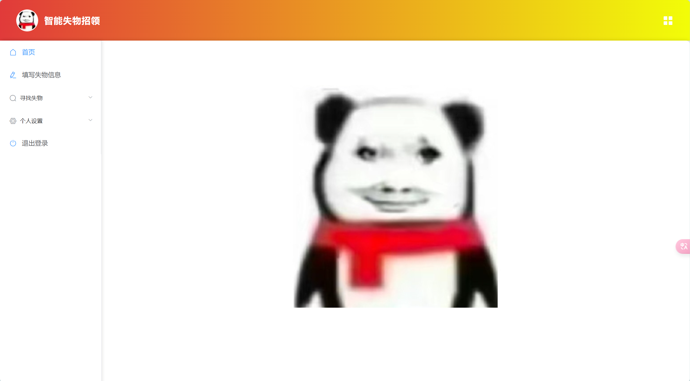
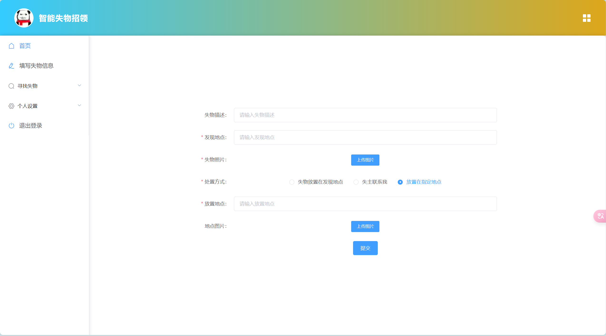
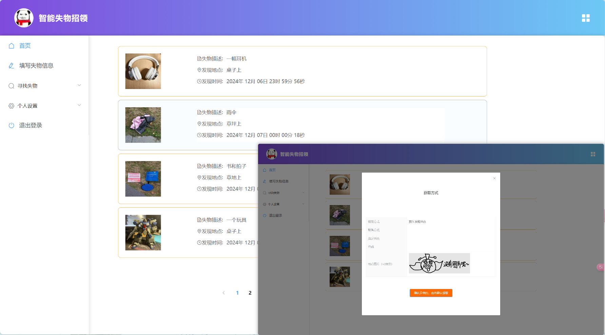
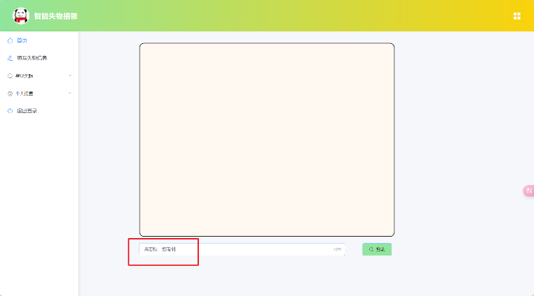
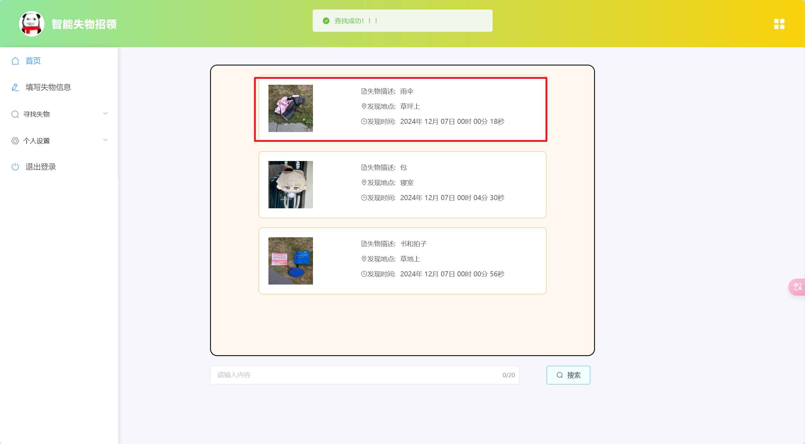
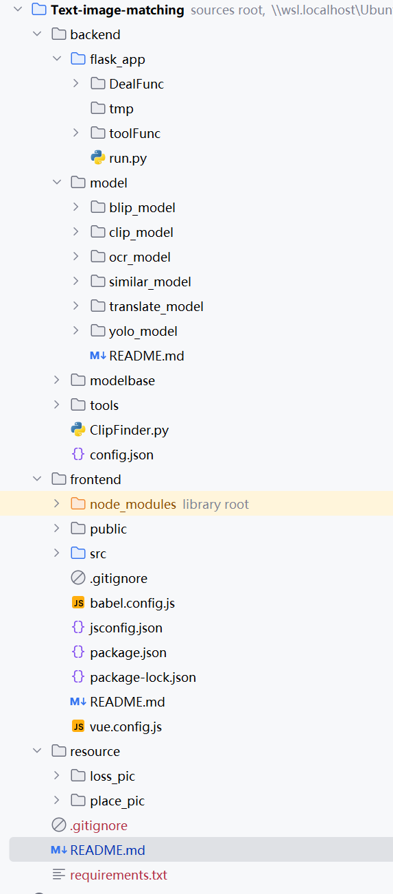

# 文图匹配
- Text-image-matching
# 一个文图匹配的项目，使用自然语言或者图片去寻找对应的图片，帮助人们寻找对应的信息
- A text image matching project that uses natural language or images to find corresponding images, helping people find corresponding information

## Acknowledgment

This project uses the [Chinese-CLIP model](https://github.com/OFA-Sys/Chinese-CLIP), which is licensed under the MIT License. We acknowledge and thank the OFA-Sys Team and contributors for their work.

## 基本思路

- 使用预训练的CLIP模型，进行图文匹配或者图图匹配，通过自然语言检索需要的图片，使用此方法得到一个相似度
- 使用yolov5模型（为了解决物体过小导致编码的特征不明显），检测图片中存在的物品，将其位置记录，动态截图使用CLIP进行编码并且保存，输入句子时进行相似度计算得到一个相似度
- 将上述两个相似度进行加权相加

## 项目迭代

- 第一版使用的是基础的CLIP进行单单的识别，没有别的东西，效果中规中矩，在使用自己的图片测试的时候发现仅仅使用CLIP对一些细节把握不是很好，会输出一些很不相似的图片
- 第二版在第一版CLIP的基础上又添加了一个BLIP模块，使用BLIP对图片库里面的图片生成描述，再将其与输入文本进行相似度计算，与CLIP的结果加权平均取出相似度高的图片，但是这版效果也就那样，对于拍摄稍微偏一些或者小物体，识别不好
- 第三步添加了yolov5的预训练模型，为了解决之前代码无法关注到小物体或者边缘物体的问题，首先使用yolov5对图片库的图片进行检测切分，并且使用CLIP对图片进行编码保存，为了弥补有时候无法识别物体的缺陷，将这一版计算的相似度与第一版进行加权相加，效果比之前都好一些
> 这下大概算是能用的一版，虽然我知道他还很烂🤡🤡🤡，持续优化中...

## 项目环境
- Python 3.10.15
- Ubuntu 22.04.5 LTS

## 预览展示
- 登录注册

- 主界面

- 表单填写

- 全部物品浏览

- 智能查找

## 开始使用
- 前端项目启动
>前端项目为`frontend`文件夹，使用的时Vue2（我只会大概用这个🤡），使用`npm install`安装依赖包，使用`npm run serve`启动
- 后端项目
>前端项目为`backend`文件夹，在`flask_app`文件夹下启动`run.py`文件启动
>>第一次启动需要安装依赖包，使用`pip install -r requirements.txt`，并且需要安装一些模型文件，有些慢的，会安装在`./backend/model`文件夹下面，如果config文件设置正确🤡。
`./backend/tmp文件夹不要删，里面是放锁文件的`

- 资源文件夹
> 将图片保存在`./resource`文件夹下，loss_pic是失物照片，place_pic是指定地点照片

## 整体项目结构图片
其实model里面的挺多没有用的，之前瞎搞上去的

